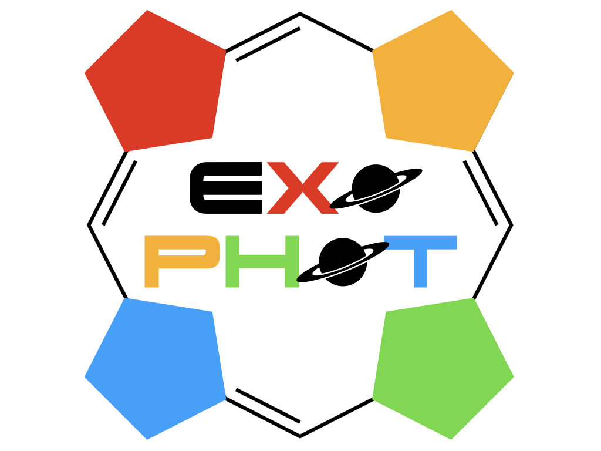

# Photosynthetic systems in exoplanets - ExoPhot

Academia MdM CAB Challenges: *Exoplanets*

*Objective:*

Study the relation between photosynthetic systems in exoplanets of stars of different 
spectral types from an astrobiological and multidisciplinar point of view. 

*Research Team:*

* J.A. Caballero (Co-PI)
* F. Gómez  (Co-PI)
* M.-A. López-Cayuela (Co-PM)
* P. Marcos-Arenal (Co-PM)
* M. Burillo
* L. Cerdán
* N. Fonseca-Bonilla
* J. García de la Concepción 
* A. López
