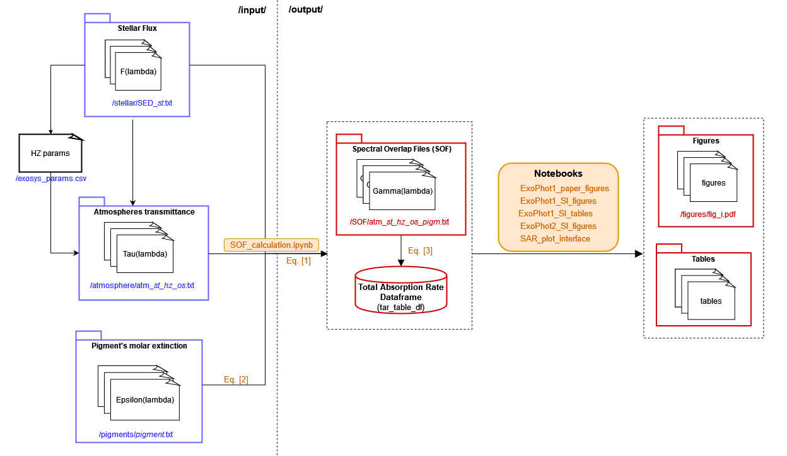

[](https://mybinder.org/v2/gh/ExoPhotProject/ExoPhot/Release)


# Photosynthetic systems in exoplanets - ExoPhot

### *Objective:*

Study the relation between photosynthetic systems in exoplanets of stars of different
spectral types from an astrobiological and multidisciplinar point of view.

---

## Research Team:

|   |   |
|---|---|
| Principal Investigators | Felipe Gómez and José Antonio Caballero |
| WG0. Project Manager | Pablo Marcos-Arenal |
| WG1. Photo-Systems Coordinator | Juan García de la Concepción |
| WG2. Stars Coordinator | Nuria Fonseca-Bonilla |
| WG3. Planetary Atmospheres Coordinator | María-Ángeles López-Cayuela |
| WG4. Spectral-Overlap Coordinator | Luis Cerdán |
| WG5. Instrumentation Coordinator | Mercedes Burillo Villalobos |

---

## About

This project was born from the Academia María de Maeztu at the Centro de Astrobiología Challenge entitled *Remote search and characterization of exoplanets, including atmospheric studies*.

---

## How to use this notebook

The following image shows a diagram of the inputs, outputs and notebooks involved in the data processing required to obtain the scientific results and conclusions of this project.



The Spectral Overlap Files (SOF) calculation notebook (*/notebooks/SOF_calculation*) generates the resulting spectral and total absorption rates (SAR & TAR) for each of the considered input pigment/stars/planetary atmosphere. The spectral absorption rate (SAR) is saved to spectral overlap files (SOF), while the total absorption rate (TAR, $\gamma_{t}$) is stored in a PANDAS *tar_table_df* dataframe.

The *SOF_calculation*  notebooks uses the *spectral_overlap_functions* library (imported as *sof*) located on `exophot/codes/spectral_overlap_functions.py`

These calculations are already performed, so the SOF files are included in the */output/SOF/*  folder and the notebooks providing the analysis and results figures and tables can be executed directly. If new pigments/stars/planetary atmospheres parameters are included, the *SOF_calculation* notebook needs to be executed as in the instructions indicated on it.

---

## Inputs

- *spectral_overlap_functions* library (imported as *sof*) located on `exophot/codes/spectral_overlap_functions.py`
- Pigment: files with extinction coefficient spectrum located at `exophot/input/pigments/`
- Atmospheres: files with atmosphere transmittance spectrum located at `exophot/input/atmosphere/`
- SEDs: files with spectral flux density spectrum located at `exophot/input/stellar/`
- exosys_params.csv: auxiliary file containing solar radii (Rs) and habitable zone (HZ) boundaries (inner, mid, outer) for different solar spectral types located at `exophot/input/exosys_params.csv`

---

## Outputs

- Spectral Overlap Files (SOF) under `exophot/output/SOF` containing:
    - Date
    - SED file
    - atmosphere file
    - photopigment file
    - Stellar radius (Rs in km)
    - Exoplanet orbit semi-major axis (sma in km)
    - Total absorption rate (gamma_t in s-1)
    - B band absorption rate (gamma_B in s-1)
    - Q band absorption rate (gamma_Q in s-1)
    - B-Q bands cut-off (in nm)
    - photosynthetic photon flux density (ppfd in micromol photon m-2 s-1)
    - Total Stellar Irradiance (S in W m-2):
    * Col 1: Wavelength (wl in Angstrom)
    * Col 2: Spectral Flux Density (F_l in J cm-2 s-1 A-1)
    * Col 3: Atmosphere transmitance (T, no units)
    * Col 4: Pigment absorption cross section (sigma_abs in cm^2)
    * Col 5: Spectral Absorption Rate (Gamma_lambda in A-1 s-1)
- tar_table_df: pandas dataframe with Total Absorption Rate (TAR, $\gamma$)
containing resulting absortion rates ($\gamma$), photosynthetic photon flux density (ppfd) and stellar irradiance (S) for a combination of stars, atmospheres and pigments.
    - $\gamma_t$: total absorption rate [s-1]
    - $\gamma_B$: absorption rate at B band [s-1]
    - $\gamma_Q$: absorption rate at Q band [s-1]
    - ppfd: photosynthetic photon flux density [micromol photon m-2 s-1]
    - S: Total Stellar Irradiance (in W m-2)

---

## References

If your research benefits from the use this work, we would appreciate if you could include the following reference/s in your publication:

```markdown
P. Marcos-Arenal, et al., Exophot. a new metric for quantifying the exoplanetary photosynthetic activity fitness. (2022)
J. García de la Concepción, et al., Exophot. phot0, a plausible primeval pigment on earth and rocky exoplanets. (2022).
```

---

## License

The code in this repository, including all  notebooks, is released under the [MIT license](notion://www.notion.so/LICENSE-CODE). Read more at the [Open Source Initiative](https://opensource.org/licenses/MIT).
